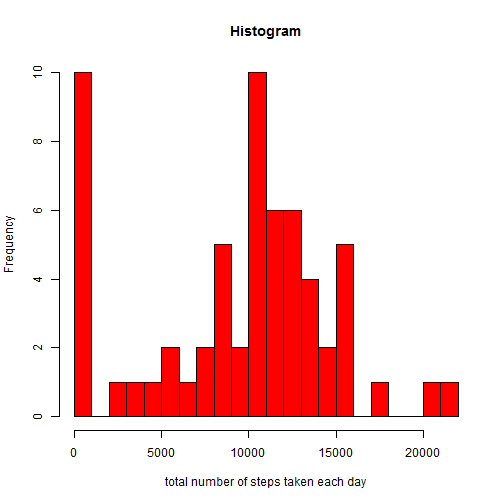
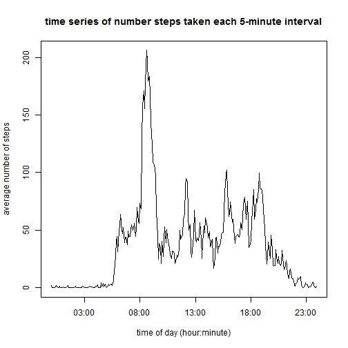
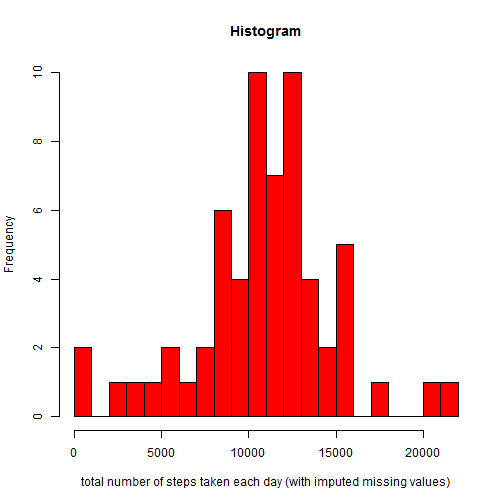
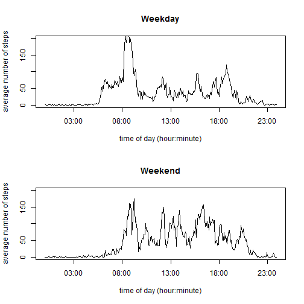

# Reproducible Research: Peer Assessment 1


## Loading and preprocessing the data

I will be using the package "plyr" to analyze the data. 


```r
    library(yaml) ; library(htmltools) ; library(rmarkdown) ; library(knitr) ; library(plyr)   
    frame <- read.csv("./activity.csv", header = TRUE) ;
    set.seed(1)
    ndata = dim(frame)[1]
```
Ten sampled lines from the data frame are shown below

```r
    ten_sampled_lines = sort(sample.int(ndata,10))
    frame[ten_sampled_lines,]
```

```
##       steps       date interval
## 1085    175 2012-10-04     1820
## 3543     32 2012-10-13      710
## 4665      0 2012-10-17      440
## 6538      0 2012-10-23     1645
## 10063    NA 2012-11-04     2230
## 11048    12 2012-11-08      835
## 11605    NA 2012-11-10      700
## 15779     0 2012-11-24     1850
## 15953     0 2012-11-25      920
## 16591   441 2012-11-27     1430
```

To facilitate the analysis, I added more columns to the data frame using the R command "transform". The added columns are:  
- time of day in hour and minute format  
- time in POSIX format to facilitate plotting  
- day of the week (Monday through Sunday)  
- weekday / weekend flag  

The code to add additional columns is shown below:

```r
    temp <- sprintf("%04d", frame$interval)
    hour <- substr(temp, 1, 2)
    minute <- substr(temp, 3, 4)
    time_string <- sprintf("%s:%s:00", hour, minute)
    date_time_string <- paste(frame$date, time_string)
    date_time <- strptime(date_time_string, "%Y-%m-%d %H:%M:%S")
    day = weekdays(date_time)
    weekday_flag = rep("weekday", length(day))
    for (i in 1:length(day)) { 
        if (day[i] == "Sunday" || day[i] == "Saturday") {
            weekday_flag[i] = "weekend"
        } else {
            weekday_flag[i] = "weekday"
        }
    }
    
    frame <- transform(frame, 
                       time_of_day = sprintf("%s:%s", hour, minute),
                       time_POSIX = date_time,
                       day_of_week = day,
                       weekday_flag = weekday_flag
                      )
```

Ten sampled lines of the resulting new data columns are shown below

```r
frame[ten_sampled_lines,c(1,4:7)]
```

```
##       steps time_of_day          time_POSIX day_of_week weekday_flag
## 1085    175       18:20 2012-10-04 18:20:00    Thursday      weekday
## 3543     32       07:10 2012-10-13 07:10:00    Saturday      weekend
## 4665      0       04:40 2012-10-17 04:40:00   Wednesday      weekday
## 6538      0       16:45 2012-10-23 16:45:00     Tuesday      weekday
## 10063    NA       22:30 2012-11-04 22:30:00      Sunday      weekend
## 11048    12       08:35 2012-11-08 08:35:00    Thursday      weekday
## 11605    NA       07:00 2012-11-10 07:00:00    Saturday      weekend
## 15779     0       18:50 2012-11-24 18:50:00    Saturday      weekend
## 15953     0       09:20 2012-11-25 09:20:00      Sunday      weekend
## 16591   441       14:30 2012-11-27 14:30:00     Tuesday      weekday
```
## What is mean total number of steps taken per day?

Statistics on the number of steps taken each day can be aggregated using the "plyr" package as shown below.


```r
    summary_by_date <- ddply(
        frame, .(date), summarize, total = sum(steps, na.rm = TRUE)
    )

    hist(summary_by_date$total, col = "red", breaks = 20, 
     xlab = "total number of steps taken each day", main = "Histogram"
     )
```

 

```r
    summary(summary_by_date$total, digits=5)
```

```
##    Min. 1st Qu.  Median    Mean 3rd Qu.    Max. 
##       0    6778   10395    9354   12811   21194
```
The average and median total number of steps taken each day are 9354.2295 and 10395, respectively.

## What is the average daily activity pattern?

Statistics on the number of steps taken on each 5-minute interval can be aggregated using the "plyr" package as shown below.

```r
    summary_by_interval <- ddply(
        frame, .(time_of_day), summarize, average = round(mean(steps, na.rm = TRUE), 2)
    )
    plot(strptime(summary_by_interval$time_of_day, format="%H:%M"), summary_by_interval$average, type="l",
     xlab = "time of day (hour:minute)", ylab = "average number of steps", 
     main = "time series of number steps taken each 5-minute interval"
    )
```

 

## Imputing missing values

The number of missing values can be calculated using the code below

```r
    flag <- is.na(frame$steps)
    sum(flag)
```

```
## [1] 2304
```
There are 2304 missing values in 17568 rows of the data set.

Missing values of the data set can be filled in as follows:  
- calculate the average number of steps for each 5-minute interval for each day of the week (Monday-Sunday)  
- if the step-value is missing, assign the average number of steps based on time-of-day and day-of-the-week  

The code to calculate average number of steps per time of day and per day of the week is shown below


```r
    summary_time_and_day <- ddply(
        frame, .(day_of_week, time_of_day), summarize,
        average = round(mean(steps, na.rm = TRUE), 2)
    )
```

A new dataset with missing values filled in is created with the code below


```r
frame2 <- transform(frame)

    for (row in 1:dim(frame2)[[1]]) {
        if (is.na(frame2[row,]$steps)) {
            d_o_w <- frame2[row,]$day_of_week
            t_o_d <- frame2[row,]$time_of_day
            frame2[row,]$steps = 
                summary_time_and_day[summary_time_and_day$day_of_week == d_o_w &
                                     summary_time_and_day$time_of_day == t_o_d,]$average
        }
    }
```
Statistics on the number of steps taken each day with imputed missing values are shown below

```r
    summary_by_date <- ddply(
        frame2, .(date), summarize, total = sum(steps, na.rm = TRUE)
    )

    hist(summary_by_date$total, col = "red", breaks = 20, 
     xlab = "total number of steps taken each day (with imputed missing values)", main = "Histogram"
     )
```

 

```r
    summary(summary_by_date$total, digits=5)
```

```
##    Min. 1st Qu.  Median    Mean 3rd Qu.    Max. 
##      41    8918   11015   10821   12811   21194
```
The average and median total number of steps taken each day are 1.0821 &times; 10<sup>4</sup> and 1.1015 &times; 10<sup>4</sup>, respectively.  The mean and median of the number of steps taken each day increased after imputing missing values since many of the missing values occurred on weekends where there were more actitivities.

## Are there differences in activity patterns between weekdays and weekends?

A variable with two levels "weekday" and "weekend" was created above (see section "loading and processing data").  The average number of steps can be aggregated over 2 variables time-of-day and weekday-weekend flag as shown below.


```r
    summary_weekday_weekend <- ddply(
        frame2, .(time_of_day, weekday_flag), summarize,
        average = round(mean(steps, na.rm = TRUE), 2)
    )
```

One can see from the time-series plots below that during the weekend, the subject wakes up later (little activity before 7am during the weekend) but also takes more steps during the waking hours.


```r
    flag <- (summary_weekday_weekend$weekday_flag == "weekday")
    subset1 <- summary_weekday_weekend[flag == "TRUE",]
    subset2 <- summary_weekday_weekend[flag == "FALSE",]

    par(mfrow = c(2,1))
    
    plot(
         strptime(subset1$time_of_day, format="%H:%M"), subset1$average, type = "l", 
         ylab = "average number of steps", xlab = "time of day (hour:minute)", 
         main = "Weekday", ylim = c(0,200)
    )
    plot(
         strptime(subset2$time_of_day, format="%H:%M"), subset2$average, type = "l",
         ylab = "average number of steps", xlab = "time of day (hour:minute)",
         main = "Weekend", ylim = c(0,200)
    )
```

 

```r
    summary(subset1$average)
```

```
##    Min. 1st Qu.  Median    Mean 3rd Qu.    Max. 
##     0.0     2.3    24.2    35.6    52.6   237.0
```

```r
    summary(subset2$average)
```

```
##    Min. 1st Qu.  Median    Mean 3rd Qu.    Max. 
##     0.0     1.1    32.0    43.1    75.6   175.0
```

The average number of steps taken each day during the weekday and during the weekend are 35.6163 and 43.0783, respectively.
